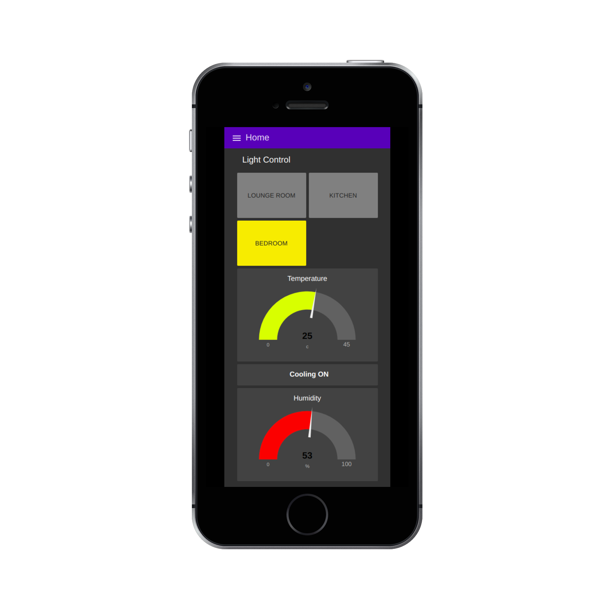
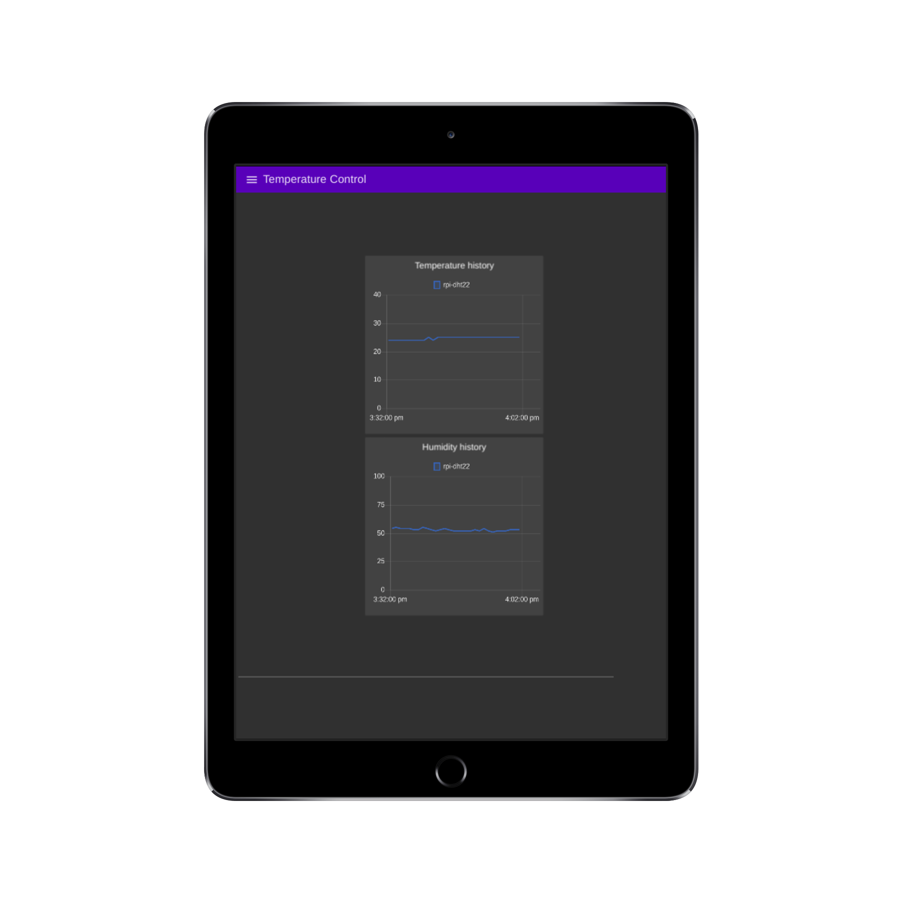
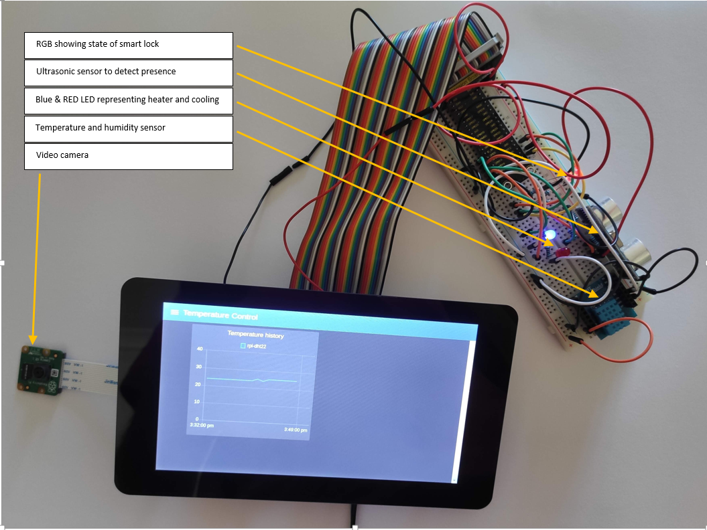
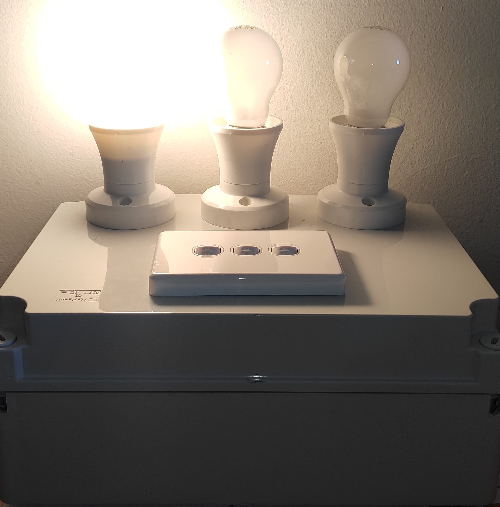
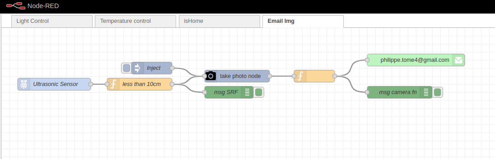
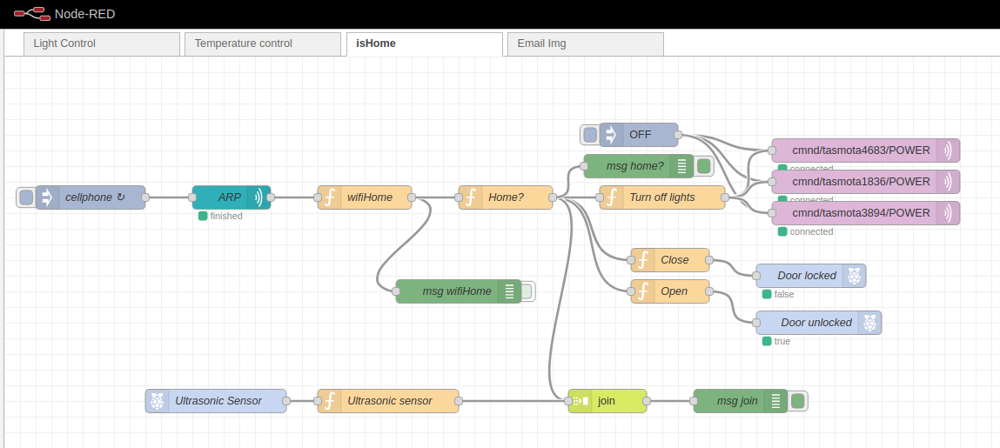
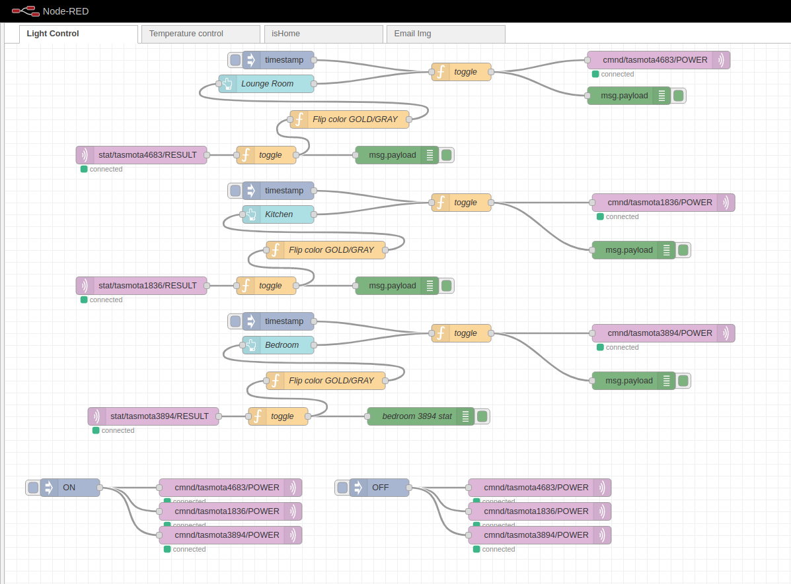
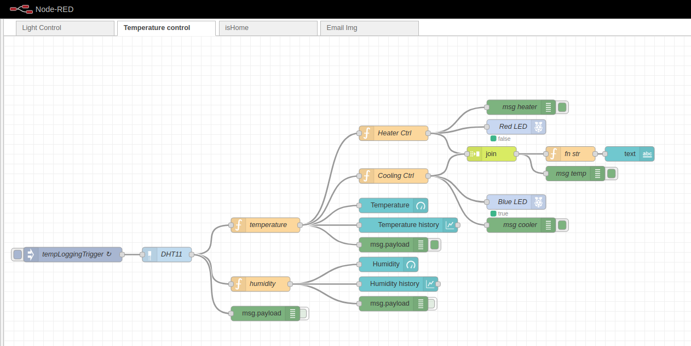

# Smart-Home-Hub

Video demo here: https://youtu.be/ARp1G0b43_s

1. [What is a Smart Home Hub?](#what)
2. [Why creating my own?](#why)
3. [Functionalities](#functionalities)
4. [Hardware used:](#hardware)
5. [Technologies used:](#technologies)
6. [Flows:](#flows)

## 1. What is a Smart Home Hub? 

A smart home hub is a hardware and/or software that connects devices together on a home automation network and controls communications among them. Smart home hubs, which connect either locally or to the cloud, are useful for the internet of things (IoT) devices.

## 2. Why creating my own? 

There are a lot of smart devices on the market to allow people to connect devices in their house. However, most of them are not open source and rely on the internet and cloud services provided by third parties.

I am a big fan of privacy and after everything that has happened in the past few years regarding data breaches, I wanted to explore and provide a solution that is 100% open source and does not rely on any third parties.

## 3. Functionalities of my Smart-Home-Hub: 

- Turn On/Off the light of your choice.
- Presence detection using Bluetooth and WiFi MAC addresses recorded to recognise when you are home.
- A smart-lock that opens when your smart device is within range.
- All lights and other apparatus of your choice turning off automatically as soon as you leave the house.
- A security camera that takes a photo of who is in front of your door and emails it instantly.
- Temperature control: logs temperature every 5 minutes and start/stop heater and cooling system. Turn off when not at home and can be programmed to heat the house before getting up and turn off when no one is home.

## 4. Hardware used: 

- Raspberry Pi 3b+
- Pi Camera V2
- Raspberry Pi 7" touchscreen
- Ultrasonic sensor HC-SR04
- Temperature/Humidity sensor DHT-11
- 1 x RGB LED
- 1 x Blue LED
- 1 x Red LED
- 8 x 220 ohms resistor
- 1 x Hole breadboard
- 1 RPI GPIO extension board
- 20 x Jumper wires
- 3 x Sonoff mini relays (firmware flashed)
- 3 x light bulbs
- 3 x light switches

## 5. Technologies used: 

- Debian version v10.3
- Node-Red version v1.0.4
- NodeJS v12.16.1
- MQTT
- Mosquitto v1.5.7
- Tasmota v8.1.0.10

## 6. Flows: 

- Flow for the door camera presence detection and emailing photo:
  

- Flow to detect is home by using WiFi detection:
  

- Flow to control the lights:
  

- Flow for the temperature control program:
  

<!-- Problem solving
demo solution
challenges & coolt tech
lessons learnt -->
